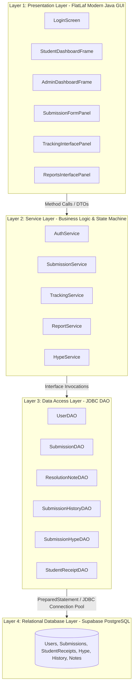
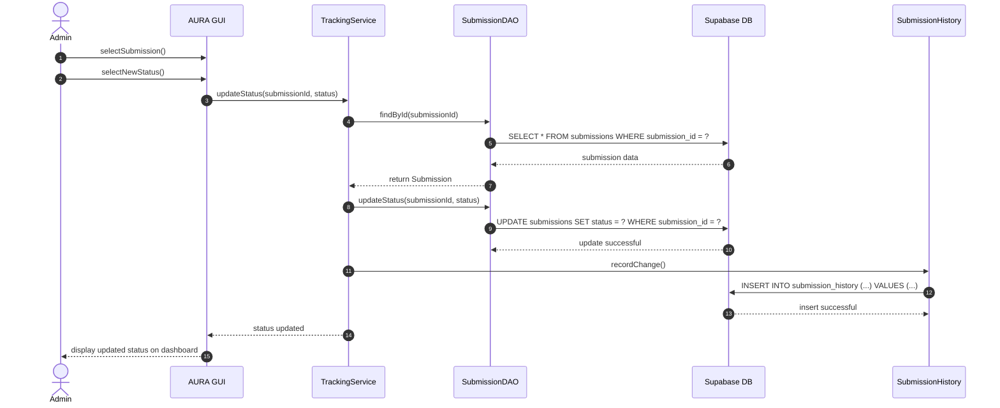
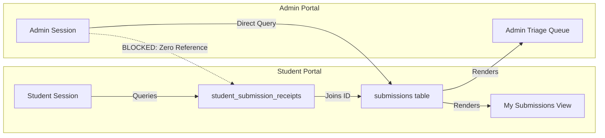

# Architecture Specification — AURA

**Autonomous University Response and Action**  
Department of Computer Science & Engineering, TKM College of Engineering (TKMCE)  
Academic Reference: APJ Abdul Kalam Technological University (KTU) CST205 / CSL203

---

## 1. Executive Summary & Approved Design Alignment

This document formalizes the technical architecture of AURA, directly reflecting and expanding upon the approved Phase 1 architecture presentation ([`docs/AURA.pdf`](AURA.pdf), Slides 11–15). 

AURA is built strictly with **Java 17 (SE)**, modern **FlatLaf** desktop GUI, **JDBC DAO patterns**, and cloud-hosted **Supabase PostgreSQL** relational persistence. It adheres to all object-oriented programming (OOP) principles mandated by the KTU syllabus while resolving real-world security challenges through an innovative **Decoupled Anonymity Vault**.

---

## 2. 4-Layer System Architecture (Slide 12 & 15)

As approved in Slide 12 and Slide 15 of [`docs/AURA.pdf`](AURA.pdf), the system enforces strict downward dependency flow with complete separation of concerns:



### Architectural Layering Rules (Non-Negotiable):
1. **Downwards Only:** `Layer 1 (GUI)` calls `Layer 2 (Service)`. `Layer 2` calls `Layer 3 (DAO)`. `Layer 3` calls `Layer 4 (Database)`.
2. **Strict Encapsulation:** GUI classes never import `java.sql.*` or execute SQL. Only `aura.dao` classes may touch JDBC.
3. **Exception Translation:** Low-level `SQLException` instances are caught within the DAO/Service boundary and wrapped in domain exceptions (`AuraException`, `InvalidCredentialsException`, `UnauthorizedActionException`).

---

## 3. Approved UML Class Diagram (Slide 14)

The diagram below mirrors the exact UML Class Diagram approved by faculty in Slide 14 of [`docs/AURA.pdf`](AURA.pdf), with the natural addition of the `SubmissionHype` entity and `HypeService` for the trending mechanism:

```mermaid
classDiagram
    %% PACKAGE MODEL
    class User {
        -int userId
        -String name
        -String email
        -String password
        -Role role
        +login() boolean
        +logout() void
        +getRole() Role
    }

    class Student {
        +submitIssue() Issue
        +submitSuggestion() Suggestion
        +viewSubmissions() List~Submission~
        +trackSubmission(int submissionId) Submission
    }

    class Admin {
        +viewSubmissions() List~Submission~
        +reviewSubmission(int submissionId) void
        +assignSubmission(int submissionId) void
        +updateStatus(int submissionId, SubmissionStatus status) void
        +addResolutionNote(int submissionId, String note) void
        +viewDashboard() void
        +generateReport() void
    }

    class Submission {
        -int submissionId
        -String title
        -String description
        -SubmissionType type
        -Priority priority
        -SubmissionStatus status
        -LocalDateTime createdAt
        +createSubmission() void
        +updateStatus(SubmissionStatus status) void
        +getStatus() SubmissionStatus
        +getDetails() String
    }

    class Issue {
        +createIssue() Issue
    }

    class Suggestion {
        +createSuggestion() Suggestion
    }

    class SubmissionHistory {
        -int historyId
        -int submissionId
        -SubmissionStatus oldStatus
        -SubmissionStatus newStatus
        -int changedBy
        -LocalDateTime changedAt
        +recordChange() void
    }

    class ResolutionNote {
        -int noteId
        -int submissionId
        -int adminId
        -String note
        -LocalDateTime createdAt
        +addNote() void
    }

    class SubmissionHype {
        -int hypeId
        -int submissionId
        -int studentId
        -LocalDateTime createdAt
    }

    User <|-- Student
    User <|-- Admin
    Submission <|-- Issue
    Submission <|-- Suggestion

    User "1" --> "0..*" Submission : creates
    Admin "1" --> "0..*" ResolutionNote : created by
    Submission "1" --> "0..*" SubmissionHistory : manages / reviews
    Submission "1" --> "0..*" ResolutionNote : has
    Submission "1" --> "0..*" SubmissionHype : receives

    %% PACKAGE ENUM
    class Role {
        <<enumeration>>
        STUDENT
        ADMIN
    }

    class SubmissionType {
        <<enumeration>>
        ISSUE
        SUGGESTION
    }

    class Priority {
        <<enumeration>>
        LOW
        MEDIUM
        HIGH
    }

    class SubmissionStatus {
        <<enumeration>>
        PENDING
        ASSIGNED
        IN_PROGRESS
        RESOLVED
        REJECTED
    }

    %% PACKAGE SERVICE
    class AuthService {
        +authenticate(String email, String password) User
        +logout(int userId) void
        +validateCredentials(String email, String password) boolean
    }

    class SubmissionService {
        +createSubmission(Submission submission) Submission
        +getSubmission(int submissionId) Submission
        +getStudentSubmissions(int studentId) List~Submission~
        +updateSubmission(Submission submission) void
    }

    class TrackingService {
        +getStatus(int submissionId) SubmissionStatus
        +updateStatus(int submissionId, SubmissionStatus status) void
        +getSubmissionHistory(int submissionId) List~SubmissionHistory~
    }

    class ReportService {
        +generateReport(Map~String, Object~ filters) byte[]
        +getDashboardStatistics() Map~String, Object~
    }

    class HypeService {
        +addHype(int submissionId, int studentId) void
        +removeHype(int submissionId, int studentId) void
        +getHypeCount(int submissionId) int
        +hasStudentHyped(int submissionId, int studentId) boolean
    }

    %% PACKAGE DAO
    class UserDAO {
        +save(User user) void
        +findById(int id) User
        +findByEmail(String email) User
        +update(User user) void
        +delete(int id) void
    }

    class SubmissionDAO {
        +save(Submission submission) void
        +findById(int id) Submission
        +findByStudent(int studentId) List~Submission~
        +findAll() List~Submission~
        +updateStatus(int id, SubmissionStatus status) void
        +delete(int id) void
    }

    class StudentReceiptDAO {
        +createReceipt(int studentId, int submissionId) void
        +findSubmissionIdsByStudent(int studentId) List~Integer~
    }

    AuthService ..> UserDAO : uses
    SubmissionService ..> SubmissionDAO : uses
    TrackingService ..> SubmissionDAO : uses
    ReportService ..> SubmissionDAO : uses
    HypeService ..> SubmissionDAO : uses
```



---

## 4. Approved UML Sequence Diagram (Slide 11)

The method invocation sequence for an administrator triaging an issue, updating its status, and recording audit history is formalized directly from Slide 11:



---

## 5. The Decoupled Anonymity Vault

### Problem with Legacy Implementation:
In the initial draft, `submissions.student_id` was a foreign key in the submissions table, and the software relied on Java programmers "promising" never to query it in admin methods (`AGENT.md` rule 2). If an administrator opened pgAdmin or DBeaver and ran `SELECT * FROM submissions;`, the student's identity was immediately exposed.

### The Decoupled Vault Solution:
In our modernized architecture:
1. **Physical Decoupling:** The `submissions` table has **no `student_id` column whatsoever**.
2. **Private Receipt Vault:** A separate table `student_submission_receipts` maps `(receipt_id, student_id, submission_id, created_at)`.
3. **Cryptographic & Architectural Guarantee:**
   - Administrators query `submissions` directly. Because `student_id` does not exist in that table, administrative code cannot leak student identities even if compromised or misconfigured.
   - When a student views **"My Submissions"**, `TrackingService` queries `StudentReceiptDAO.findSubmissionIdsByStudent(studentId)` and retrieves only the matching public submissions.



---

## 6. Package & Directory Structure

```
src/main/java/aura/
├── Main.java                        # Entry point: sets FlatLaf Dark L&F, opens LoginFrame
├── config/
│   └── DatabaseConfig.java          # Reads db.properties, manages TLS JDBC connection pool
├── model/                           # Plain Domain POJOs (Slide 14)
│   ├── User.java
│   ├── Student.java
│   ├── Admin.java
│   ├── Submission.java
│   ├── Issue.java
│   ├── Suggestion.java
│   ├── SubmissionHistory.java
│   ├── ResolutionNote.java
│   └── SubmissionHype.java
├── enums/                           # Domain Enumerations (Slide 14)
│   ├── Role.java
│   ├── SubmissionType.java
│   ├── Priority.java
│   └── SubmissionStatus.java
├── dao/                             # JDBC Data Access Objects with PreparedStatements
│   ├── UserDAO.java
│   ├── SubmissionDAO.java
│   ├── StudentReceiptDAO.java       # Manages the Decoupled Anonymity Vault
│   ├── SubmissionHypeDAO.java       # Manages upvotes & trending aggregation
│   ├── ResolutionNoteDAO.java
│   └── SubmissionHistoryDAO.java
├── service/                         # Business Logic & State Transition Services
│   ├── AuthService.java             # Domain validation & BCrypt authentication
│   ├── SubmissionService.java       # Submission lifecycle & categorization
│   ├── TrackingService.java         # State transitions & "My Submissions" resolution
│   ├── HypeService.java             # Trending scores & one-vote enforcement
│   └── ReportService.java           # CSV generation & dashboard metrics
├── ui/                              # FlatLaf Modern Desktop GUI (Slides 20-23)
│   ├── LoginFrame.java              # Approved Slide 20 Mockup
│   ├── student/
│   │   ├── StudentDashboardFrame.java # Approved Slide 21 Mockup
│   │   └── SubmissionFormPanel.java   # Approved Slide 22 Mockup
│   └── admin/
│       ├── AdminDashboardFrame.java   # Approved Slide 23 Mockup
│       └── ReportPanel.java           # Analytics & CSV export view
└── util/                            # Cross-Cutting Utilities
    ├── PasswordUtil.java            # jBCrypt wrapper
    ├── ValidationUtil.java          # @tkmce.ac.in domain regex & length constraints
    └── SessionContext.java          # In-memory session holder
```

---

## 7. Team Responsibility & Module Ownership Matrix (Slide 17)

To satisfy the rubric requirement for **"Substantial individual contribution supported by evidence"**, ownership is divided according to the approved slide assignments from Slide 17 of [`docs/AURA.pdf`](AURA.pdf):

| Team Member | Roll No | Slide Ownership | Technical Modules & Package Ownership |
|---|---|---|---|
| **Muhammed Rinshid VP** *(Team Lead)* | B25CS045 | Slides 1–4, 20 | **System Coordination, Core Architecture & Integration:** `aura.Main`, `aura.config.DatabaseConfig`, `aura.ui.LoginFrame`, Supabase cloud configuration. |
| **Nirmal Binoy** | B25CS052 | Slides 5–8 | **Proposed Solution, Models & Trending Engine:** `aura.model.*`, `aura.enums.*`, `aura.service.HypeService`, `aura.dao.SubmissionHypeDAO`. |
| **Mohammed Nafih** | B25CS037 | Slides 9–12 | **RBAC, Anonymity Vault & Security Pipeline:** `aura.service.AuthService`, `aura.dao.StudentReceiptDAO`, `aura.util.PasswordUtil`, `aura.util.ValidationUtil`. |
| **Rahandeep RD** | B25CS053 | Slides 13–14, 18 | **Database Engineering & FlatLaf Desktop GUI:** `sql/schema.sql`, `sql/seed.sql`, `aura.ui.student.*`, `aura.dao.SubmissionDAO`, `aura.dao.UserDAO`. |
| **Athil Rahuman A** | B25CS084 | Slides 15–17, 19 | **Audit Lifecycle, Admin Dashboard & Analytics:** `aura.service.TrackingService`, `aura.service.ReportService`, `aura.ui.admin.*`, `aura.dao.ResolutionNoteDAO`. |
