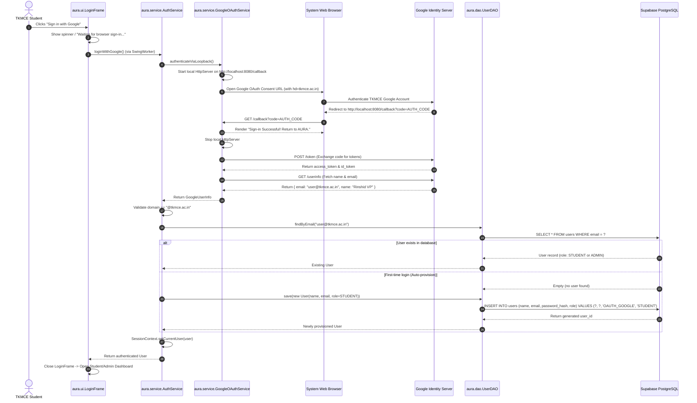

# AURA — Developer Task Guide: Google OAuth 2.0 Desktop Authentication & User Provisioning

**Project:** Autonomous University Response and Action (AURA)  
**Department:** Computer Science & Engineering, TKM College of Engineering (TKMCE)  
**Academic Reference:** KTU CST205 (Object-Oriented Programming with Java) / CSL203  
**Target Assignee:** Team Security & Authentication Lead  
**Governing Documents:** [`AGENT.md`](../AGENT.md) & [`docs/ARCHITECTURE.md`](ARCHITECTURE.md)  

---

## 1. Task Objective & Context

### The Mission
You are tasked with implementing the complete **Google OAuth 2.0 Authentication & User Provisioning Pipeline** for the AURA desktop MVP. 

In campus governance, authentication serves two critical purposes:
1. **Institutional Trust:** Only verified members of TKM College of Engineering with an official `@tkmce.ac.in` Google Workspace account may access the platform.
2. **Decoupled Anonymity Protection:** While students must authenticate to access the system, their student identity is decoupled from their campus submissions via the **Decoupled Anonymity Vault** ([`docs/ARCHITECTURE.md`](ARCHITECTURE.md#5-the-decoupled-anonymity-vault)).

### What You Will Build
1. **Google OAuth 2.0 Native Loopback Handler (RFC 8252):** A lightweight, pure Java 17 loopback HTTP server that opens the student's default browser, intercepts the OAuth authorization code, and retrieves user profile details.
2. **Institutional Domain Enforcement:** Strict validation ensuring only accounts ending with `@tkmce.ac.in` are granted access.
3. **Database Auto-Provisioning (JDBC):** Automatic persistence of first-time student accounts into the Supabase PostgreSQL `users` table, while respecting pre-seeded `ADMIN` roles.
4. **Session Management:** A thread-safe, in-memory `SessionContext` holding the authenticated user.
5. **Modern FlatLaf Swing Login Screen:** An asynchronous, non-freezing desktop login frame with Google sign-in and loading states.
6. **Offline / Dev Mock Mode:** A development toggle so you and the team can test student and admin flows offline without needing Google Cloud credentials.
7. **Automated JUnit 5 Tests:** Unit tests verifying domain validation and authentication logic.

---

## 2. Architectural Blueprint & Layer Rules

Per [`AGENT.md`](../AGENT.md), AURA strictly enforces a 4-layer downward dependency structure. You must never violate these boundaries:

```
aura.ui (FlatLaf Swing)  →  aura.service  →  aura.dao  →  Supabase PostgreSQL
```

- **`aura.ui`** (`LoginFrame`) may **only** call `aura.service` (`AuthService`). It must **never** import `java.sql.*` or call `UserDAO` directly.
- **`aura.service`** (`AuthService`, `GoogleOAuthService`) coordinates business logic, domain checks, and invokes DAOs. It must never construct database connections directly.
- **`aura.dao`** (`UserDAO`) is the **only** package permitted to execute SQL and touch JDBC. Every query must use `PreparedStatement` with parameterized placeholders (`?`).

### Authentication Flow (RFC 8252 Loopback Architecture)



---

## 3. External Setup: Google Cloud Console (One-Time)

To test with real Google credentials, complete these steps on Google Cloud Console:

1. **Sign in to Google Cloud:** Visit [console.cloud.google.com](https://console.cloud.google.com/) with any Google account.
2. **Create a New Project:** Name it `AURA-TKMCE`.
3. **Configure OAuth Consent Screen:**
   - Go to **APIs & Services $\rightarrow$ OAuth consent screen**.
   - User Type: Select **External** (or **Internal** if using a college Google Workspace admin console).
   - App Name: `AURA Campus Governance`.
   - User Support Email: Your email.
   - Developer Contact Email: Your email.
   - Click **Save and Continue**.
4. **Scopes:**
   - Click **Add or Remove Scopes**.
   - Select: `.../auth/userinfo.email`, `.../auth/userinfo.profile`, and `openid`.
   - Click **Update $\rightarrow$ Save and Continue**.
5. **Test Users (Crucial while in Testing status):**
   - Add your `@tkmce.ac.in` email and your teammates' `@tkmce.ac.in` emails as Authorized Test Users.
6. **Create OAuth 2.0 Credentials:**
   - Go to **APIs & Services $\rightarrow$ Credentials $\rightarrow$ Create Credentials $\rightarrow$ OAuth Client ID**.
   - Application Type: Select **Desktop app** (or **Web application**).
   - Name: `AURA Desktop Client`.
   - If Web Application is selected:
     - Authorized redirect URIs: Add `http://localhost:8080/callback` (must be exact!).
   - Click **Create**.
7. **Copy Credentials to Local File:**
   - Copy the generated **Client ID** and **Client Secret**.
   - In the project, copy `src/main/resources/oauth.properties.example` to `src/main/resources/oauth.properties`.
   - Fill in your Client ID and Client Secret:
     ```properties
     oauth.google.client.id=YOUR_CLIENT_ID.apps.googleusercontent.com
     oauth.google.client.secret=YOUR_CLIENT_SECRET
     oauth.google.redirect.uri=http://localhost:8080/callback
     oauth.server.port=8080
     oauth.enforced.domain=tkmce.ac.in
     oauth.dev.mode=false
     ```
   *(Note: `oauth.properties` is already added to `.gitignore` so your secret will never be accidentally pushed).*

---

## 4. Maven Dependency (`pom.xml`)

We use pure Java 17 built-ins (`java.net.http.HttpClient` and `com.sun.net.httpserver.HttpServer`) to keep our application lightweight and easy to defend. We only need `gson` for JSON parsing.

Open [`pom.xml`](../pom.xml) and add the following dependency inside `<dependencies>`:

```xml
        <!-- Google Gson: Lightweight JSON parser for OAuth token & profile responses -->
        <dependency>
            <groupId>com.google.code.gson</groupId>
            <artifactId>gson</artifactId>
            <version>2.11.0</version>
        </dependency>
```

---

## 5. Implementation Steps & Code Skeletons

Follow these steps in order. Each class must be created in the exact package listed.

```
src/main/java/aura/
├── enums/
│   └── Role.java                      # STEP 1
├── model/
│   └── User.java                      # STEP 1
├── config/
│   └── OAuthConfig.java               # STEP 2
├── util/
│   ├── ValidationUtil.java            # STEP 3
│   └── SessionContext.java            # STEP 4
├── dao/
│   └── UserDAO.java                   # STEP 5
├── service/
│   ├── GoogleOAuthService.java        # STEP 6
│   └── AuthService.java               # STEP 7
└── ui/
    └── LoginFrame.java                # STEP 8
```

---

### Step 1: Enums & Domain Models

#### [`src/main/java/aura/enums/Role.java`](file:///c:/Users/lenovo/Documents/GitHub/AURA/src/main/java/aura/enums/Role.java)
```java
package aura.enums;

/**
 * System roles for Role-Based Access Control (RBAC).
 */
public enum Role {
    STUDENT,
    ADMIN;

    public static Role fromString(String value) {
        if (value == null) return STUDENT;
        try {
            return Role.valueOf(value.trim().toUpperCase());
        } catch (IllegalArgumentException e) {
            return STUDENT;
        }
    }
}
```

#### [`src/main/java/aura/model/User.java`](file:///c:/Users/lenovo/Documents/GitHub/AURA/src/main/java/aura/model/User.java)
```java
package aura.model;

import aura.enums.Role;
import java.time.LocalDateTime;

/**
 * User domain entity representing students and administrators.
 */
public class User {
    private int userId;
    private String name;
    private String email;
    private Role role;
    private LocalDateTime createdAt;

    public User() {}

    public User(int userId, String name, String email, Role role, LocalDateTime createdAt) {
        this.userId = userId;
        this.name = name;
        this.email = email;
        this.role = role;
        this.createdAt = createdAt;
    }

    public User(String name, String email, Role role) {
        this.name = name;
        this.email = email;
        this.role = role;
        this.createdAt = LocalDateTime.now();
    }

    public int getUserId() { return userId; }
    public void setUserId(int userId) { this.userId = userId; }

    public String getName() { return name; }
    public void setName(String name) { this.name = name; }

    public String getEmail() { return email; }
    public void setEmail(String email) { this.email = email; }

    public Role getRole() { return role; }
    public void setRole(Role role) { this.role = role; }

    public LocalDateTime getCreatedAt() { return createdAt; }
    public void setCreatedAt(LocalDateTime createdAt) { this.createdAt = createdAt; }

    public boolean isAdmin() { return this.role == Role.ADMIN; }
    public boolean isStudent() { return this.role == Role.STUDENT; }

    @Override
    public String toString() {
        return "User{" + "userId=" + userId + ", name='" + name + '\'' + ", email='" + email + '\'' + ", role=" + role + '}';
    }
}
```

---

### Step 2: OAuth Configuration Reader

#### [`src/main/java/aura/config/OAuthConfig.java`](file:///c:/Users/lenovo/Documents/GitHub/AURA/src/main/java/aura/config/OAuthConfig.java)
Reads `oauth.properties` with safe fallbacks and development mode detection.

```java
package aura.config;

import java.io.IOException;
import java.io.InputStream;
import java.util.Properties;

public class OAuthConfig {
    private static final Properties props = new Properties();

    static {
        try (InputStream in = OAuthConfig.class.getClassLoader().getResourceAsStream("oauth.properties")) {
            if (in != null) {
                props.load(in);
            } else {
                System.out.println("[WARN] oauth.properties not found on classpath. Using defaults / dev mock mode.");
            }
        } catch (IOException e) {
            System.err.println("[ERROR] Failed to load oauth.properties: " + e.getMessage());
        }
    }

    public static String getClientId() {
        return props.getProperty("oauth.google.client.id", "");
    }

    public static String getClientSecret() {
        return props.getProperty("oauth.google.client.secret", "");
    }

    public static String getRedirectUri() {
        return props.getProperty("oauth.google.redirect.uri", "http://localhost:8080/callback");
    }

    public static int getServerPort() {
        return Integer.parseInt(props.getProperty("oauth.server.port", "8080"));
    }

    public static String getEnforcedDomain() {
        return props.getProperty("oauth.enforced.domain", "tkmce.ac.in");
    }

    public static boolean isDevMode() {
        return Boolean.parseBoolean(props.getProperty("oauth.dev.mode", "true"));
    }
}
```

---

### Step 3: Institutional Domain Validation

#### [`src/main/java/aura/util/ValidationUtil.java`](file:///c:/Users/lenovo/Documents/GitHub/AURA/src/main/java/aura/util/ValidationUtil.java)
Enforces the mandatory `@tkmce.ac.in` domain rule.

```java
package aura.util;

import java.util.regex.Pattern;

public class ValidationUtil {
    private static final Pattern TKMCE_EMAIL_PATTERN = 
            Pattern.compile("^[A-Za-z0-9._%+-]+@tkmce\\.ac\\.in$", Pattern.CASE_INSENSITIVE);

    /**
     * Validates whether an email belongs to the institutional @tkmce.ac.in domain.
     */
    public static boolean isValidTkmceEmail(String email) {
        if (email == null || email.isBlank()) {
            return false;
        }
        return TKMCE_EMAIL_PATTERN.matcher(email.trim()).matches();
    }
}
```

---

### Step 4: User Session Context

#### [`src/main/java/aura/util/SessionContext.java`](file:///c:/Users/lenovo/Documents/GitHub/AURA/src/main/java/aura/util/SessionContext.java)
A thread-safe singleton holding the active user across GUI views.

```java
package aura.util;

import aura.model.User;

public class SessionContext {
    private static volatile User currentUser;

    public static synchronized void setCurrentUser(User user) {
        currentUser = user;
    }

    public static synchronized User getCurrentUser() {
        return currentUser;
    }

    public static synchronized boolean isAuthenticated() {
        return currentUser != null;
    }

    public static synchronized void clearSession() {
        currentUser = null;
    }
}
```

---

### Step 5: Database Access Object (`UserDAO`)

#### [`src/main/java/aura/dao/UserDAO.java`](file:///c:/Users/lenovo/Documents/GitHub/AURA/src/main/java/aura/dao/UserDAO.java)
Handles parameterized database queries via `DatabaseConfig`. Implements `findByEmail` and `save` (auto-provisioning).

```java
package aura.dao;

import aura.config.DatabaseConfig;
import aura.enums.Role;
import aura.model.User;

import java.sql.*;
import java.util.Optional;

public class UserDAO {

    /**
     * Finds an existing user by email.
     */
    public Optional<User> findByEmail(String email) throws SQLException {
        String sql = "SELECT user_id, name, email, role, created_at FROM users WHERE email = ?";
        try (Connection conn = DatabaseConfig.getConnection();
             PreparedStatement ps = conn.prepareStatement(sql)) {
            ps.setString(1, email.trim().toLowerCase());
            try (ResultSet rs = ps.executeQuery()) {
                if (rs.next()) {
                    User user = new User(
                        rs.getInt("user_id"),
                        rs.getString("name"),
                        rs.getString("email"),
                        Role.fromString(rs.getString("role")),
                        rs.getTimestamp("created_at").toLocalDateTime()
                    );
                    return Optional.of(user);
                }
            }
        }
        return Optional.empty();
    }

    /**
     * Auto-provisions a new student user in Supabase.
     * Note: password_hash is stored as 'OAUTH_GOOGLE' since passwords are not used with OAuth.
     */
    public User save(User user) throws SQLException {
        String sql = "INSERT INTO users (name, email, password_hash, role) VALUES (?, ?, ?, ?) RETURNING user_id, created_at";
        try (Connection conn = DatabaseConfig.getConnection();
             PreparedStatement ps = conn.prepareStatement(sql)) {
            ps.setString(1, user.getName());
            ps.setString(2, user.getEmail().trim().toLowerCase());
            ps.setString(3, "OAUTH_GOOGLE");
            ps.setString(4, user.getRole().name());

            try (ResultSet rs = ps.executeQuery()) {
                if (rs.next()) {
                    user.setUserId(rs.getInt("user_id"));
                    user.setCreatedAt(rs.getTimestamp("created_at").toLocalDateTime());
                    return user;
                }
            }
        }
        throw new SQLException("Failed to insert user: no ID returned.");
    }
}
```

---

### Step 6: Google OAuth 2.0 Loopback Service

#### [`src/main/java/aura/service/GoogleOAuthService.java`](file:///c:/Users/lenovo/Documents/GitHub/AURA/src/main/java/aura/service/GoogleOAuthService.java)
The core native loopback implementation following RFC 8252.

```java
package aura.service;

import aura.config.OAuthConfig;
import com.google.gson.JsonObject;
import com.google.gson.JsonParser;
import com.sun.net.httpserver.HttpServer;

import java.awt.Desktop;
import java.io.IOException;
import java.io.OutputStream;
import java.net.InetSocketAddress;
import java.net.URI;
import java.net.URLEncoder;
import java.net.http.HttpClient;
import java.net.http.HttpRequest;
import java.net.http.HttpResponse;
import java.nio.charset.StandardCharsets;
import java.security.SecureRandom;
import java.time.Duration;
import java.util.Base64;
import java.util.concurrent.CompletableFuture;
import java.util.concurrent.TimeUnit;

public class GoogleOAuthService {

    public record GoogleUserInfo(String email, String name, String pictureUrl) {}

    private final HttpClient httpClient = HttpClient.newBuilder()
            .connectTimeout(Duration.ofSeconds(10))
            .build();

    /**
     * Executes the full RFC 8252 Loopback OAuth Flow:
     * 1. Launches local HTTP server
     * 2. Opens system browser to Google consent page
     * 3. Intercepts authorization code
     * 4. Exchanges code for access token
     * 5. Retrieves user profile from Google
     */
    public GoogleUserInfo executeOAuthFlow() throws Exception {
        String clientId = OAuthConfig.getClientId();
        String clientSecret = OAuthConfig.getClientSecret();
        String redirectUri = OAuthConfig.getRedirectUri();
        int port = OAuthConfig.getServerPort();

        if (clientId.isBlank() || clientSecret.isBlank()) {
            throw new IllegalStateException("Google OAuth credentials missing in oauth.properties!");
        }

        // Generate CSRF state token
        byte[] randomBytes = new byte[16];
        new SecureRandom().nextBytes(randomBytes);
        String stateToken = Base64.getUrlEncoder().withoutPadding().encodeToString(randomBytes);

        CompletableFuture<String> authCodeFuture = new CompletableFuture<>();

        // Start local loopback HTTP server
        HttpServer server = HttpServer.create(new InetSocketAddress(port), 0);
        server.createContext("/callback", exchange -> {
            String query = exchange.getRequestURI().getQuery();
            String code = null;
            String returnedState = null;

            if (query != null) {
                for (String param : query.split("&")) {
                    String[] pair = param.split("=");
                    if (pair.length == 2) {
                        if ("code".equals(pair[0])) code = pair[1];
                        if ("state".equals(pair[0])) returnedState = pair[1];
                    }
                }
            }

            String htmlResponse;
            int statusCode;

            if (code != null && stateToken.equals(returnedState)) {
                authCodeFuture.complete(code);
                statusCode = 200;
                htmlResponse = """
                    <!DOCTYPE html>
                    <html>
                    <head><title>AURA Authentication</title><style>
                    body { font-family: -apple-system, BlinkMacSystemFont, 'Segoe UI', Roboto, sans-serif;
                           background: #0b0f17; color: #f3f4f6; display: flex; align-items: center;
                           justify-content: center; height: 100vh; margin: 0; text-align: center; }
                    .card { background: #111827; border: 1px solid #374151; padding: 40px; border-radius: 12px; box-shadow: 0 10px 30px rgba(0,0,0,0.5); }
                    h2 { color: #10b981; margin-bottom: 8px; }
                    p { color: #9ca3af; }
                    </style></head>
                    <body>
                    <div class="card">
                        <h2>✓ Authentication Successful!</h2>
                        <p>Your Google account has been verified. You may close this tab and return to <strong>AURA</strong>.</p>
                    </div>
                    </body></html>
                    """;
            } else {
                authCodeFuture.completeExceptionally(new SecurityException("Invalid OAuth callback or state mismatch."));
                statusCode = 400;
                htmlResponse = "<html><body><h2>Authentication failed. State mismatch.</h2></body></html>";
            }

            byte[] bytes = htmlResponse.getBytes(StandardCharsets.UTF_8);
            exchange.getResponseHeaders().set("Content-Type", "text/html; charset=UTF-8");
            exchange.sendResponseHeaders(statusCode, bytes.length);
            try (OutputStream os = exchange.getResponseBody()) {
                os.write(bytes);
            }
        });

        server.start();

        try {
            // Build Google Authorization URL
            String authUrl = "https://accounts.google.com/o/oauth2/v2/auth?"
                    + "client_id=" + URLEncoder.encode(clientId, StandardCharsets.UTF_8)
                    + "&redirect_uri=" + URLEncoder.encode(redirectUri, StandardCharsets.UTF_8)
                    + "&response_type=code"
                    + "&scope=" + URLEncoder.encode("openid email profile", StandardCharsets.UTF_8)
                    + "&state=" + URLEncoder.encode(stateToken, StandardCharsets.UTF_8)
                    + "&hd=" + URLEncoder.encode(OAuthConfig.getEnforcedDomain(), StandardCharsets.UTF_8);

            // Open System Browser
            if (Desktop.isDesktopSupported() && Desktop.getDesktop().isSupported(Desktop.Action.BROWSE)) {
                Desktop.getDesktop().browse(new URI(authUrl));
            } else {
                throw new UnsupportedOperationException("Desktop browser not supported on this platform.");
            }

            // Wait up to 2 minutes for user to complete browser sign-in
            String authCode = authCodeFuture.get(120, TimeUnit.SECONDS);

            // Exchange Authorization Code for Access Token
            String accessToken = exchangeCodeForToken(authCode, clientId, clientSecret, redirectUri);

            // Fetch User Profile from Google
            return fetchUserProfile(accessToken);

        } finally {
            server.stop(1);
        }
    }

    private String exchangeCodeForToken(String code, String clientId, String clientSecret, String redirectUri) throws Exception {
        String requestBody = "code=" + URLEncoder.encode(code, StandardCharsets.UTF_8)
                + "&client_id=" + URLEncoder.encode(clientId, StandardCharsets.UTF_8)
                + "&client_secret=" + URLEncoder.encode(clientSecret, StandardCharsets.UTF_8)
                + "&redirect_uri=" + URLEncoder.encode(redirectUri, StandardCharsets.UTF_8)
                + "&grant_type=authorization_code";

        HttpRequest request = HttpRequest.newBuilder()
                .uri(URI.create("https://oauth2.googleapis.com/token"))
                .header("Content-Type", "application/x-www-form-urlencoded")
                .POST(HttpRequest.BodyPublishers.ofString(requestBody))
                .build();

        HttpResponse<String> response = httpClient.send(request, HttpResponse.BodyHandlers.ofString());

        if (response.statusCode() != 200) {
            throw new IOException("Failed to exchange code with Google: HTTP " + response.statusCode() + " - " + response.body());
        }

        JsonObject json = JsonParser.parseString(response.body()).getAsJsonObject();
        return json.get("access_token").getAsString();
    }

    private GoogleUserInfo fetchUserProfile(String accessToken) throws Exception {
        HttpRequest request = HttpRequest.newBuilder()
                .uri(URI.create("https://www.googleapis.com/oauth2/v3/userinfo"))
                .header("Authorization", "Bearer " + accessToken)
                .GET()
                .build();

        HttpResponse<String> response = httpClient.send(request, HttpResponse.BodyHandlers.ofString());

        if (response.statusCode() != 200) {
            throw new IOException("Failed to fetch user profile: HTTP " + response.statusCode());
        }

        JsonObject json = JsonParser.parseString(response.body()).getAsJsonObject();
        String email = json.get("email").getAsString();
        String name = json.has("name") ? json.get("name").getAsString() : "TKMCE Student";
        String picture = json.has("picture") ? json.get("picture").getAsString() : null;

        return new GoogleUserInfo(email, name, picture);
    }
}
```

---

### Step 7: Authentication Orchestration Service

#### [`src/main/java/aura/service/AuthService.java`](file:///c:/Users/lenovo/Documents/GitHub/AURA/src/main/java/aura/service/AuthService.java)
Orchestrates Google OAuth, institutional domain verification, user lookup/auto-provisioning, and session context initialization.

```java
package aura.service;

import aura.config.OAuthConfig;
import aura.dao.UserDAO;
import aura.enums.Role;
import aura.model.User;
import aura.util.SessionContext;
import aura.util.ValidationUtil;

import java.sql.SQLException;
import java.util.Optional;

public class AuthService {
    private final GoogleOAuthService oAuthService;
    private final UserDAO userDAO;

    public AuthService() {
        this.oAuthService = new GoogleOAuthService();
        this.userDAO = new UserDAO();
    }

    public AuthService(GoogleOAuthService oAuthService, UserDAO userDAO) {
        this.oAuthService = oAuthService;
        this.userDAO = userDAO;
    }

    /**
     * Executes real Google OAuth login flow with institutional validation and auto-provisioning.
     */
    public User loginWithGoogle() throws Exception {
        // 1. Run OAuth flow and retrieve user profile
        GoogleOAuthService.GoogleUserInfo info = oAuthService.executeOAuthFlow();

        // 2. Enforce institutional domain check
        if (!ValidationUtil.isValidTkmceEmail(info.email())) {
            throw new SecurityException("Access Denied: Only official @tkmce.ac.in Google accounts are allowed. Attempted: " + info.email());
        }

        // 3. Check database for existing user or auto-provision
        return processUserLogin(info.name(), info.email());
    }

    /**
     * Offline development bypass for team testing without Google credentials.
     */
    public User loginMock(Role role) throws SQLException {
        if (!OAuthConfig.isDevMode()) {
            throw new SecurityException("Mock login is disabled in production mode.");
        }

        String mockEmail = (role == Role.ADMIN) ? "admin.demo@tkmce.ac.in" : "student.demo@tkmce.ac.in";
        String mockName = (role == Role.ADMIN) ? "Demo Administrator" : "Demo Student";

        return processUserLogin(mockName, mockEmail, role);
    }

    private User processUserLogin(String name, String email) throws SQLException {
        return processUserLogin(name, email, Role.STUDENT);
    }

    private User processUserLogin(String name, String email, Role defaultRole) throws SQLException {
        Optional<User> existingUser = userDAO.findByEmail(email);

        User user;
        if (existingUser.isPresent()) {
            user = existingUser.get();
        } else {
            // Auto-provision first-time user
            user = new User(name, email, defaultRole);
            user = userDAO.save(user);
        }

        // 4. Bind to SessionContext
        SessionContext.setCurrentUser(user);
        return user;
    }

    public void logout() {
        SessionContext.clearSession();
    }
}
```

---

### Step 8: Modern FlatLaf Swing Login Screen

#### [`src/main/java/aura/ui/LoginFrame.java`](file:///c:/Users/lenovo/Documents/GitHub/AURA/src/main/java/aura/ui/LoginFrame.java)
Renders a sleek, modern desktop window matching Slide 20 of [`docs/AURA.pdf`](AURA.pdf). It uses a background `SwingWorker` so the desktop GUI remains fluid while waiting for the user to complete their Google browser sign-in.

```java
package aura.ui;

import aura.config.OAuthConfig;
import aura.enums.Role;
import aura.model.User;
import aura.service.AuthService;
import com.formdev.flatlaf.FlatDarkLaf;

import javax.swing.*;
import javax.swing.border.EmptyBorder;
import java.awt.*;

public class LoginFrame extends JFrame {
    private final AuthService authService = new AuthService();

    private JButton btnGoogleLogin;
    private JButton btnDevStudent;
    private JButton btnDevAdmin;
    private JLabel lblStatus;
    private JProgressBar progressBar;

    public LoginFrame() {
        setTitle("AURA — Campus Issue & Suggestion Governance");
        setDefaultCloseOperation(JFrame.EXIT_ON_CLOSE);
        setSize(480, 560);
        setLocationRelativeTo(null);
        setResizable(false);

        initComponents();
    }

    private void initComponents() {
        JPanel root = new JPanel();
        root.setLayout(new BoxLayout(root, BoxLayout.Y_AXIS));
        root.setBorder(new EmptyBorder(32, 40, 32, 40));
        root.setBackground(new Color(17, 24, 39)); // Tailwind gray-900

        // Campus Badge
        JLabel lblCollege = new JLabel("TKM COLLEGE OF ENGINEERING");
        lblCollege.setFont(new Font("Inter", Font.BOLD, 12));
        lblCollege.setForeground(new Color(129, 140, 248)); // Indigo-400
        lblCollege.setAlignmentX(Component.CENTER_ALIGNMENT);

        // AURA Title
        JLabel lblTitle = new JLabel("AURA");
        lblTitle.setFont(new Font("Inter", Font.BOLD, 36));
        lblTitle.setForeground(Color.WHITE);
        lblTitle.setAlignmentX(Component.CENTER_ALIGNMENT);

        // Subtitle
        JLabel lblSubtitle = new JLabel("Autonomous University Response & Action");
        lblSubtitle.setFont(new Font("Inter", Font.PLAIN, 13));
        lblSubtitle.setForeground(new Color(156, 163, 175));
        lblSubtitle.setAlignmentX(Component.CENTER_ALIGNMENT);

        // Institutional Badge
        JLabel lblDomainHint = new JLabel("🔒 Exclusive to @tkmce.ac.in accounts");
        lblDomainHint.setFont(new Font("Inter", Font.ITALIC, 11));
        lblDomainHint.setForeground(new Color(52, 211, 153)); // Emerald-400
        lblDomainHint.setAlignmentX(Component.CENTER_ALIGNMENT);

        // Google Sign-In Button
        btnGoogleLogin = new JButton("  Sign in with Google  ");
        btnGoogleLogin.setFont(new Font("Inter", Font.BOLD, 14));
        btnGoogleLogin.setPreferredSize(new Dimension(320, 48));
        btnGoogleLogin.setMaximumSize(new Dimension(320, 48));
        btnGoogleLogin.setBackground(new Color(31, 41, 55));
        btnGoogleLogin.setForeground(Color.WHITE);
        btnGoogleLogin.setCursor(new Cursor(Cursor.HAND_CURSOR));
        btnGoogleLogin.setAlignmentX(Component.CENTER_ALIGNMENT);
        btnGoogleLogin.addActionListener(e -> initiateGoogleLogin());

        // Progress Bar
        progressBar = new JProgressBar();
        progressBar.setIndeterminate(true);
        progressBar.setVisible(false);
        progressBar.setMaximumSize(new Dimension(300, 4));
        progressBar.setAlignmentX(Component.CENTER_ALIGNMENT);

        // Status Label
        lblStatus = new JLabel(" ");
        lblStatus.setFont(new Font("Inter", Font.PLAIN, 12));
        lblStatus.setForeground(new Color(209, 213, 219));
        lblStatus.setAlignmentX(Component.CENTER_ALIGNMENT);

        // Assemble Layout
        root.add(lblCollege);
        root.add(Box.createVerticalStrut(8));
        root.add(lblTitle);
        root.add(Box.createVerticalStrut(4));
        root.add(lblSubtitle);
        root.add(Box.createVerticalStrut(32));
        root.add(btnGoogleLogin);
        root.add(Box.createVerticalStrut(12));
        root.add(lblDomainHint);
        root.add(Box.createVerticalStrut(20));
        root.add(progressBar);
        root.add(Box.createVerticalStrut(8));
        root.add(lblStatus);

        // Dev Mode Bypass Buttons (If dev mode enabled)
        if (OAuthConfig.isDevMode()) {
            root.add(Box.createVerticalStrut(24));
            JSeparator sep = new JSeparator();
            sep.setMaximumSize(new Dimension(320, 1));
            sep.setForeground(new Color(55, 65, 81));
            root.add(sep);
            root.add(Box.createVerticalStrut(16));

            JLabel lblDev = new JLabel("⚡ Developer Offline Testing (Mock)");
            lblDev.setFont(new Font("Inter", Font.BOLD, 11));
            lblDev.setForeground(new Color(245, 158, 11)); // Amber-500
            lblDev.setAlignmentX(Component.CENTER_ALIGNMENT);
            root.add(lblDev);
            root.add(Box.createVerticalStrut(10));

            JPanel devPanel = new JPanel(new GridLayout(1, 2, 10, 0));
            devPanel.setOpaque(false);
            devPanel.setMaximumSize(new Dimension(320, 36));

            btnDevStudent = new JButton("Mock Student");
            btnDevStudent.setFont(new Font("Inter", Font.PLAIN, 12));
            btnDevStudent.addActionListener(e -> executeMockLogin(Role.STUDENT));

            btnDevAdmin = new JButton("Mock Admin");
            btnDevAdmin.setFont(new Font("Inter", Font.PLAIN, 12));
            btnDevAdmin.addActionListener(e -> executeMockLogin(Role.ADMIN));

            devPanel.add(btnDevStudent);
            devPanel.add(btnDevAdmin);
            root.add(devPanel);
        }

        setContentPane(root);
    }

    private void initiateGoogleLogin() {
        setLoading(true, "Waiting for Google sign-in in browser...");

        // Run OAuth in background worker so Swing UI does not freeze
        SwingWorker<User, Void> worker = new SwingWorker<>() {
            @Override
            protected User doInBackground() throws Exception {
                return authService.loginWithGoogle();
            }

            @Override
            protected void done() {
                try {
                    User user = get();
                    onLoginSuccess(user);
                } catch (Exception ex) {
                    setLoading(false, " ");
                    String message = ex.getCause() != null ? ex.getCause().getMessage() : ex.getMessage();
                    JOptionPane.showMessageDialog(LoginFrame.this,
                            "Authentication Failed:\n" + message,
                            "AURA Security Alert",
                            JOptionPane.ERROR_MESSAGE);
                }
            }
        };

        worker.execute();
    }

    private void executeMockLogin(Role role) {
        try {
            User user = authService.loginMock(role);
            onLoginSuccess(user);
        } catch (Exception ex) {
            JOptionPane.showMessageDialog(this,
                    "Mock Login Failed: " + ex.getMessage(),
                    "Error",
                    JOptionPane.ERROR_MESSAGE);
        }
    }

    private void setLoading(boolean loading, String statusText) {
        btnGoogleLogin.setEnabled(!loading);
        if (btnDevStudent != null) btnDevStudent.setEnabled(!loading);
        if (btnDevAdmin != null) btnDevAdmin.setEnabled(!loading);
        progressBar.setVisible(loading);
        lblStatus.setText(statusText);
    }

    private void onLoginSuccess(User user) {
        setLoading(false, "Welcome, " + user.getName() + "!");
        JOptionPane.showMessageDialog(this,
                "✓ Authentication Successful!\nLogged in as: " + user.getName() + " (" + user.getRole() + ")",
                "AURA Access Granted",
                JOptionPane.INFORMATION_MESSAGE);

        // Dispose login frame and redirect to respective dashboard
        this.dispose();

        SwingUtilities.invokeLater(() -> {
            if (user.isAdmin()) {
                System.out.println("[NAV] Launching Admin Dashboard for: " + user.getEmail());
                // new AdminDashboardFrame().setVisible(true);
            } else {
                System.out.println("[NAV] Launching Student Dashboard for: " + user.getEmail());
                // new StudentDashboardFrame().setVisible(true);
            }
        });
    }

    public static void main(String[] args) {
        // Initialize modern FlatLaf Look and Feel before GUI render
        FlatDarkLaf.setup();
        SwingUtilities.invokeLater(() -> new LoginFrame().setVisible(true));
    }
}
```

---

## 6. Automated Unit Tests (JUnit 5)

Per `AGENT.md` Rule 6, code is only "Done" when it is accompanied by an automated JUnit 5 test class.

#### [`src/test/java/aura/util/ValidationUtilTest.java`](file:///c:/Users/lenovo/Documents/GitHub/AURA/src/test/java/aura/util/ValidationUtilTest.java)
```java
package aura.util;

import org.junit.jupiter.api.DisplayName;
import org.junit.jupiter.api.Test;
import org.junit.jupiter.params.ParameterizedTest;
import org.junit.jupiter.params.provider.ValueSource;

import static org.junit.jupiter.api.Assertions.*;

class ValidationUtilTest {

    @ParameterizedTest
    @ValueSource(strings = {
            "b25cs045@tkmce.ac.in",
            "rinshid.vp@tkmce.ac.in",
            "hodcse@tkmce.ac.in",
            "student_2025@tkmce.ac.in"
    })
    @DisplayName("Should accept valid @tkmce.ac.in institutional emails")
    void testValidTkmceEmails(String email) {
        assertTrue(ValidationUtil.isValidTkmceEmail(email));
    }

    @ParameterizedTest
    @ValueSource(strings = {
            "student@gmail.com",
            "hacker@tkmce.com",
            "someone@yahoo.in",
            "tkmce.ac.in",
            "@tkmce.ac.in",
            "student@fake.tkmce.ac.in",
            "",
            "   "
    })
    @DisplayName("Should reject non-tkmce or malformed emails")
    void testInvalidEmails(String email) {
        assertFalse(ValidationUtil.isValidTkmceEmail(email));
    }

    @Test
    @DisplayName("Should safely handle null email")
    void testNullEmail() {
        assertFalse(ValidationUtil.isValidTkmceEmail(null));
    }
}
```

#### [`src/test/java/aura/service/AuthServiceTest.java`](file:///c:/Users/lenovo/Documents/GitHub/AURA/src/test/java/aura/service/AuthServiceTest.java)
```java
package aura.service;

import aura.dao.UserDAO;
import aura.enums.Role;
import aura.model.User;
import aura.util.SessionContext;
import org.junit.jupiter.api.BeforeEach;
import org.junit.jupiter.api.DisplayName;
import org.junit.jupiter.api.Test;

import java.sql.SQLException;
import java.util.Optional;

import static org.junit.jupiter.api.Assertions.*;

class AuthServiceTest {

    static class StubUserDAO extends UserDAO {
        private User savedUser;

        @Override
        public Optional<User> findByEmail(String email) {
            if ("existing@tkmce.ac.in".equals(email)) {
                return Optional.of(new User(10, "Existing User", email, Role.STUDENT, null));
            }
            return Optional.empty();
        }

        @Override
        public User save(User user) {
            user.setUserId(99);
            this.savedUser = user;
            return user;
        }

        public User getSavedUser() { return savedUser; }
    }

    private AuthService authService;
    private StubUserDAO stubUserDAO;

    @BeforeEach
    void setUp() {
        SessionContext.clearSession();
        stubUserDAO = new StubUserDAO();
        // Null OAuth service for mock unit test
        authService = new AuthService(null, stubUserDAO);
    }

    @Test
    @DisplayName("Mock student login should succeed and set SessionContext")
    void testMockStudentLogin() throws SQLException {
        User user = authService.loginMock(Role.STUDENT);

        assertNotNull(user);
        assertEquals(Role.STUDENT, user.getRole());
        assertTrue(user.getEmail().endsWith("@tkmce.ac.in"));
        assertTrue(SessionContext.isAuthenticated());
        assertEquals(user, SessionContext.getCurrentUser());
    }

    @Test
    @DisplayName("Mock admin login should assign ADMIN role")
    void testMockAdminLogin() throws SQLException {
        User user = authService.loginMock(Role.ADMIN);

        assertNotNull(user);
        assertEquals(Role.ADMIN, user.getRole());
        assertTrue(user.isAdmin());
        assertEquals(user, SessionContext.getCurrentUser());
    }

    @Test
    @DisplayName("Logout should clear SessionContext")
    void testLogout() throws SQLException {
        authService.loginMock(Role.STUDENT);
        assertTrue(SessionContext.isAuthenticated());

        authService.logout();
        assertFalse(SessionContext.isAuthenticated());
        assertNull(SessionContext.getCurrentUser());
    }
}
```

---

## 7. Manual Testing & Verification Checklist

Once you complete the code, run these checks locally:

1. **Compile & Run Unit Tests:**
   ```bash
   mvn clean test
   ```
   *Expectation:* Zero test failures.
2. **Launch the Login GUI:**
   ```bash
   mvn exec:java -Dexec.mainClass=aura.ui.LoginFrame
   ```
3. **Verify Dev Mode (Mock Login):**
   - Click **"Mock Student"** $\rightarrow$ verify success dialog displays role `STUDENT`.
   - Click **"Mock Admin"** $\rightarrow$ verify success dialog displays role `ADMIN`.
4. **Verify Real Google Sign-In:**
   - Click **"Sign in with Google"**.
   - Verify default browser automatically opens the Google accounts page.
   - Sign in with a test `@tkmce.ac.in` account.
   - Verify browser redirects to `http://localhost:8080/callback` and shows the green **"✓ Authentication Successful!"** card.
   - Return to AURA window: verify loading spinner finishes and dashboard launch message appears in the terminal.
5. **Verify Security Constraint Rejection:**
   - Attempt sign-in with an `@gmail.com` account.
   - Verify AURA immediately blocks access with an alert dialog: `"Access Denied: Only official @tkmce.ac.in Google accounts are allowed."`
6. **Verify Database Insertion:**
   - In your database management tool (or Supabase Table Editor), run:
     ```sql
     SELECT * FROM users WHERE email LIKE '%@tkmce.ac.in';
     ```
   - Verify that your newly signed-in user exists with `role = 'STUDENT'` and `password_hash = 'OAUTH_GOOGLE'`.

---

## 8. Academic Viva Defense Q&A Cheatsheet

Prepare to explain these answers line-by-line during university viva or project reviews:

### Q1: Why did you use OAuth 2.0 instead of storing username and password in the database?
> **Answer:** *"Storing passwords creates credential exposure and phishing risks. In our campus setting, TKMCE students already have secured institutional Google accounts. By implementing Google OAuth 2.0, we delegate authentication to Google Identity Services while strictly enforcing institutional access via the `@tkmce.ac.in` domain check. Furthermore, this eliminates plaintext password handling and aligns with industry best practices."*

### Q2: What is RFC 8252 and why is a loopback redirect server used instead of an embedded browser (WebView)?
> **Answer:** *"RFC 8252 is the official OAuth 2.0 specification for Native Apps. It explicitly deprecates embedded webviews because an application could inspect keystrokes or steal cookies inside an embedded view. Instead, RFC 8252 mandates opening the user's trusted system browser and using a local loopback server (`http://localhost:8080/callback`) to receive the authorization code. This guarantees complete browser isolation and user trust."*

### Q3: How do you prevent Cross-Site Request Forgery (CSRF) in your OAuth implementation?
> **Answer:** *"Before opening the browser, `GoogleOAuthService` generates a cryptographically secure random `state` parameter using `SecureRandom` and stores it in memory. When Google redirects back to `http://localhost:8080/callback`, our loopback handler verifies that the returned `state` parameter matches our in-memory token. If an attacker attempts to inject an authorization code without a matching state, the request is rejected with a `SecurityException`."*

### Q4: If students log in with their real Google identity, how is the "Decoupled Anonymity Vault" preserved?
> **Answer:** *"Authentication only establishes that a student is an authorized member of TKMCE. Once authenticated, when a student creates an issue or suggestion, the `submissions` table contains **zero `student_id` or author information**. A completely separate private table `student_submission_receipts` maps ownership for the student's personal view, and no administrative query or UI can ever access or join that vault. Authentication proves legitimacy; the vault guarantees submission anonymity."*

### Q5: Why did you choose `java.net.http.HttpClient` over third-party libraries?
> **Answer:** *"Java 11 introduced the standardized `HttpClient` in `java.net.http`, supporting HTTP/2, asynchronous requests, and connection pooling natively in the standard library. Using built-in Java 17 features keeps our codebase lightweight, avoids bloated dependencies like Apache HttpClient or heavy Jetty servers, and allows us to clearly explain every line of networking code."*

---

## 9. Definition of Done Checklist (`AGENT.md` Compliance)

Before submitting your pull request, verify each requirement:

- [ ] `pom.xml` includes `gson` without any unnecessary extra dependencies.
- [ ] `oauth.properties.example` is present; real `oauth.properties` is in `.gitignore`.
- [ ] All classes reside in approved packages: `aura.model`, `aura.enums`, `aura.config`, `aura.util`, `aura.dao`, `aura.service`, `aura.ui`.
- [ ] Zero SQL string concatenation — `UserDAO` uses parameterized `PreparedStatement`.
- [ ] Domain validation strictly enforces `@tkmce.ac.in`.
- [ ] Loopback receiver safely stops its `HttpServer` upon request completion.
- [ ] Swing UI uses `SwingWorker` to prevent UI freezing during browser interaction.
- [ ] Unit tests in `ValidationUtilTest` and `AuthServiceTest` compile and pass with `mvn test`.
- [ ] Code compiles with zero warnings or unused imports.
- [ ] You are fully prepared to answer any question from the Viva Cheatsheet (Section 8).
