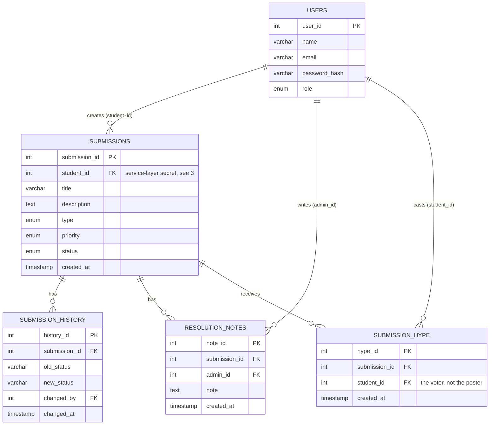

# Database Design — AURA

Companion to [`ARCHITECTURE.md`](ARCHITECTURE.md) §5 (anonymity boundary) and [`SECURITY.md`](SECURITY.md). DDL matching this document lives in [`../sql/schema.sql`](../sql/schema.sql) — the two must never drift; if you change one, change the other in the same commit.

## 1. Entity-relationship diagram

This is the original PPT's ER design (`users`, `submissions`, `submission_history`, `resolution_notes`) plus one new table, `submission_hype`, and one access-control note on `submissions.student_id` explained in §3.

## 2. Tables

### `users`
Unchanged from the original design.

| Column | Type | Notes |
|---|---|---|
| `user_id` | `INT PK AUTO_INCREMENT` | |
| `name` | `VARCHAR(100)` | |
| `email` | `VARCHAR(150) UNIQUE` | must match the TKMCE domain — enforced in `AuthService`/`ValidationUtil`, not by a DB constraint (regex isn't portable SQL; see [`SECURITY.md`](SECURITY.md)) |
| `password_hash` | `VARCHAR(255)` | BCrypt output, 60 chars — sized generously |
| `role` | `ENUM('STUDENT','ADMIN')` | |

### `submissions`
Unchanged columns from the original design — the anonymity design is an **access** change, not a **schema** change (see §3).

| Column | Type | Notes |
|---|---|---|
| `submission_id` | `INT PK AUTO_INCREMENT` | |
| `student_id` | `INT FK → users.user_id` | see §3 — never selected on admin-facing paths |
| `title` | `VARCHAR(200)` | |
| `description` | `TEXT` | |
| `type` | `ENUM('ISSUE','SUGGESTION')` | |
| `priority` | `ENUM('LOW','MEDIUM','HIGH')` | |
| `status` | `ENUM('PENDING','ASSIGNED','IN_PROGRESS','RESOLVED','REJECTED')` | default `PENDING` |
| `created_at` | `TIMESTAMP` | default `CURRENT_TIMESTAMP` |

### `submission_history`
Unchanged — audit trail of status transitions.

| Column | Type | Notes |
|---|---|---|
| `history_id` | `INT PK AUTO_INCREMENT` | |
| `submission_id` | `INT FK → submissions.submission_id` | |
| `old_status` | `VARCHAR(50)` | |
| `new_status` | `VARCHAR(50)` | |
| `changed_by` | `INT FK → users.user_id` | the admin who made the change (admins are not anonymous) |
| `changed_at` | `TIMESTAMP` | default `CURRENT_TIMESTAMP` |

### `resolution_notes`
Unchanged.

| Column | Type | Notes |
|---|---|---|
| `note_id` | `INT PK AUTO_INCREMENT` | |
| `submission_id` | `INT FK → submissions.submission_id` | |
| `admin_id` | `INT FK → users.user_id` | |
| `note` | `TEXT` | |
| `created_at` | `TIMESTAMP` | default `CURRENT_TIMESTAMP` |

### `submission_hype` — new table
| Column | Type | Notes |
|---|---|---|
| `hype_id` | `INT PK AUTO_INCREMENT` | |
| `submission_id` | `INT FK → submissions.submission_id` | |
| `student_id` | `INT FK → users.user_id` | the **voter** — this is a different identity relationship than `submissions.student_id`, and is not subject to the anonymity rule, because knowing who hyped something never reveals who posted it |
| `created_at` | `TIMESTAMP` | default `CURRENT_TIMESTAMP` |

`UNIQUE (submission_id, student_id)` — the database itself refuses a second hype from the same student on the same submission; this is not left to application logic alone (defense in depth, matches [`AGENT.md`](../AGENT.md) rule 6's "don't trust only the UI/service layer" principle applied to data integrity too).

**Hype count is computed, not cached**: `SELECT COUNT(*) FROM submission_hype WHERE submission_id = ?`, backed by an index on `submission_hype(submission_id)`. A cached counter column on `submissions` (incremented/decremented on every hype/un-hype) was considered and rejected: at campus scale the count query is trivial, while a cached counter introduces a whole class of consistency bugs (missed decrements, race conditions between concurrent hypes) that are hard to explain and harder to test convincingly for a course project.

## 3. The anonymity design, explained

The product requirement is: **nobody, including admin, can trace a submission back to the student who posted it.** But a student must still be able to see their own submission history (`FR-5` in [`TRD.md`](TRD.md)). Two identity relationships exist that must not be confused:

- `submissions.student_id` — **who posted**. This must stay invisible to every admin-facing path.
- `submission_hype.student_id` — **who voted**. This can safely be known internally (it's needed to enforce one-hype-per-student); it never reveals who posted the submission being voted on.

**The chosen design (v1): the FK stays in the schema; anonymity is enforced by never querying it from admin-reachable code.**

- `submissions.student_id` is a real, indexed FK — this is what lets `TrackingService.findMySubmissions()` do a simple, fast `WHERE student_id = ?` for the logged-in student's own dashboard.
- Every DAO method used by an admin-facing service (`AdminSubmissionService` and friends) is written to never `SELECT` that column — not filtered out afterward, simply never fetched. See [`ARCHITECTURE.md`](ARCHITECTURE.md) §5 for the exact rule and where it's enforced in code.

**Honest limitation, stated plainly:** this is an **application-layer** guarantee, not a cryptographic one. Anyone with direct SQL access to the production database (not through the app) could still run `SELECT student_id FROM submissions` and correlate it against `users`. For a campus course project with one shared MySQL instance and a small trusted team, this is a reasonable, explainable trade-off — and it's far better than silently promising something the design can't actually deliver.

**Documented stretch goal (not built for v1):** a token-based scheme where the server never stores a submission↔student link at all — instead, at submission time the server generates a random tracking code, returns it once to the submitting student's client, and the student re-supplies that code to check status later. This would remove the FK entirely and make the anonymity guarantee unlinkable even against direct DB access. It's a legitimate "if we had more time" answer for a viva/demo, not something to half-implement now.
