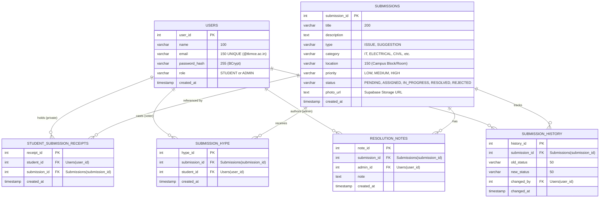

# Database Design Specification — AURA

**Autonomous University Response and Action**  
Department of Computer Science & Engineering, TKM College of Engineering (TKMCE)  
Database Engine: Supabase Cloud PostgreSQL 15+  
Presentation Reference: [`docs/AURA.pdf`](AURA.pdf) (Slide 13, 15, 24)

---

## 1. Entity-Relationship (ER) Model

The ER design builds directly on Slide 13 and Slide 24 of [`docs/AURA.pdf`](AURA.pdf), introducing the `student_submission_receipts` vault table and `submission_hype` table to resolve student privacy and crowd upvoting:



---

## 2. Table Schemas & Data Dictionary

### 2.1 `users`
Stores student and administrator credentials. Only institutional TKMCE email addresses are permitted.

| Column | Type | Constraints | Description |
|---|---|---|---|
| `user_id` | `SERIAL` | `PRIMARY KEY` | Unique identifier for each user. |
| `name` | `VARCHAR(100)` | `NOT NULL` | Full legal name of student or administrator. |
| `email` | `VARCHAR(150)` | `NOT NULL UNIQUE` | Official TKMCE domain email (`@tkmce.ac.in`). |
| `password_hash` | `VARCHAR(255)` | `NOT NULL` | Salted 60-character BCrypt hash string. |
| `role` | `VARCHAR(20)` | `CHECK IN ('STUDENT','ADMIN')` | Authorization role for RBAC enforcement. |
| `created_at` | `TIMESTAMPTZ` | `DEFAULT CURRENT_TIMESTAMP` | Account registration timestamp. |

---

### 2.2 `submissions` (Anonymous Public Issues)
**The Core Anonymity Guarantee:** Notice that this table contains **no `student_id` column**. Administrative queries across this table physically cannot access the identity of the student who created the issue.

| Column | Type | Constraints | Description |
|---|---|---|---|
| `submission_id` | `SERIAL` | `PRIMARY KEY` | Unique ticket number (e.g., `#SUB-104`). |
| `title` | `VARCHAR(200)` | `NOT NULL` | Concise summary of the issue or suggestion. |
| `description` | `TEXT` | `NOT NULL` | Detailed description of the problem or proposal. |
| `type` | `VARCHAR(20)` | `CHECK IN ('ISSUE','SUGGESTION')` | Differentiates problem reports from new ideas. |
| `category` | `VARCHAR(50)` | `NOT NULL` | Department routing (IT, Electrical, Civil, Labs, Hostel, General). |
| `location` | `VARCHAR(150)` | `NOT NULL` | Physical campus location (e.g., "CSE Lab 3"). |
| `priority` | `VARCHAR(20)` | `CHECK IN ('LOW','MEDIUM','HIGH')` | Student-assessed urgency level. |
| `status` | `VARCHAR(20)` | `DEFAULT 'PENDING'` | Current status in the 5-state lifecycle pipeline. |
| `photo_url` | `TEXT` | `NULL` | Optional URL of photo evidence in Supabase Storage. |
| `created_at` | `TIMESTAMPTZ` | `DEFAULT CURRENT_TIMESTAMP` | Ticket creation timestamp. |

---

### 2.3 `student_submission_receipts` (The Anonymity Vault)
Private receipt mapping that enables a student to track "My Submissions" without leaking their identity to administrative queues.

| Column | Type | Constraints | Description |
|---|---|---|---|
| `receipt_id` | `SERIAL` | `PRIMARY KEY` | Unique receipt identifier. |
| `student_id` | `INT` | `REFERENCES users(user_id)` | Identity of the submitting student. |
| `submission_id` | `INT` | `REFERENCES submissions(id)` | Target submission created by the student. |
| `created_at` | `TIMESTAMPTZ` | `DEFAULT CURRENT_TIMESTAMP` | Submission timestamp. |

*Unique Constraint:* `UNIQUE (student_id, submission_id)` ensures a one-to-one receipt mapping per student ticket.

---

### 2.4 `submission_hype` (Trending Upvotes)
Records crowd support from students.

| Column | Type | Constraints | Description |
|---|---|---|---|
| `hype_id` | `SERIAL` | `PRIMARY KEY` | Unique vote identifier. |
| `submission_id` | `INT` | `REFERENCES submissions(id)` | Target ticket being upvoted. |
| `student_id` | `INT` | `REFERENCES users(user_id)` | Student who cast the vote. |
| `created_at` | `TIMESTAMPTZ` | `DEFAULT CURRENT_TIMESTAMP` | Upvote timestamp. |

*Unique Constraint:* `UNIQUE (submission_id, student_id)` prevents repeat upvoting.

---

### 2.5 `resolution_notes` & `submission_history`
Stores official resolution summaries and tracks status transitions for auditability.

---

## 3. Query Optimization & Indexing Strategy

To guarantee rapid UI responsiveness, B-tree indexes are declared in `sql/schema.sql`:

1. **Trending Aggregation Index:**
   ```sql
   CREATE INDEX idx_hype_submission ON submission_hype (submission_id);
   ```
   Accelerates `SELECT COUNT(*) FROM submission_hype WHERE submission_id = ?` for calculating trending scores.
2. **Status & Category Filter Indexes:**
   ```sql
   CREATE INDEX idx_submissions_status ON submissions (status);
   CREATE INDEX idx_submissions_category ON submissions (category);
   ```
   Speeds up administrative queue filtering by status and department.
3. **Vault Lookup Index:**
   ```sql
   CREATE INDEX idx_receipts_student ON student_submission_receipts (student_id);
   ```
   Ensures instantaneous retrieval of personal tickets when a student opens the "My Submissions" dashboard.

---

## 4. Supabase Cloud Connection Configuration

Java connects to Supabase PostgreSQL using TLS-secured JDBC. In `src/main/resources/db.properties`:

```properties
db.url=jdbc:postgresql://db.YOUR_SUPABASE_PROJECT_REF.supabase.co:5432/postgres?sslmode=require
db.user=postgres
db.password=YOUR_SUPABASE_DB_PASSWORD
db.driver=org.postgresql.Driver
```
