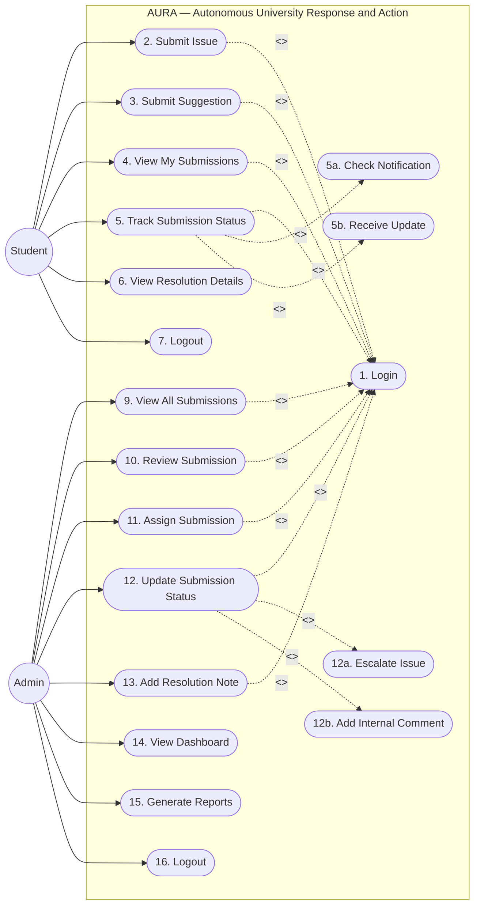

# Product Requirements Document (PRD) — AURA

**Autonomous University Response and Action**  
*"REPORT. TRACK. RESOLVE. IMPROVE."*  
Department of Computer Science & Engineering, TKM College of Engineering (TKMCE)  
Academic Reference: KTU CST205 / CSL203 • Presentation Reference: [`docs/AURA.pdf`](AURA.pdf)

---

## 1. Executive Summary & Problem Statement

Campus issues at TKM College of Engineering (TKMCE) currently travel through fragmented, untracked channels that create administrative bottlenecks and student dissatisfaction (Slide 3 & 5):

| Channel | Centralized? | Live Tracking? | Role Security? | Primary Limitation |
|---|---|---|---|---|
| **WhatsApp / Messaging** | No | No | No | Unstructured, messages buried in chat groups, zero accountability. |
| **Paper Suggestion Boxes** | Partial | No | No | Infrequent physical collection, zero feedback loop to the student. |
| **Google Forms** | Yes | No | Basic | Flat spreadsheet, lacks status lifecycle, role routing, or upvoting. |
| **AURA Platform** | **Yes (Java SE)** | **Yes (5-State)** | **Yes (RBAC)** | **Purpose-built, anonymous campus governance system.** |

### Consequences of the Status Quo:
1. **Reporting Hesitation:** Students avoid reporting real infrastructural or sensitive issues because informal channels lack anonymity and visible action.
2. **Squeaky-Wheel Bias:** Administrative attention goes to whoever shouts the loudest, rather than issues that affect hundreds of students simultaneously.
3. **Reactive Maintenance:** Campus administrators lack aggregated data on recurring infrastructural failures (e.g., specific lab projectors or water supply lines).

---

## 2. Alignment with UN Sustainable Development Goals (SDG - Slide 4)

As presented in Slide 4 of [`docs/AURA.pdf`](AURA.pdf), AURA aligns directly with United Nations SDGs:

- **SDG 16 (Peace, Justice and Strong Institutions):** Promotes transparent, accountable campus governance by providing a structured channel for reporting problems, tracking actions, and recording resolutions.
- **SDG 11 (Sustainable Cities and Communities):** Enhances campus infrastructure, safety, water access, and facility maintenance through crowd-verified reporting.
- **SDG 9 (Industry, Innovation and Infrastructure):** Replaces archaic paper/chat communication with a modern digital lifecycle platform.
- **SDG 4 (Quality Education):** Minimizes disruptions in laboratories, smart classrooms, and libraries, creating a supportive learning environment.

---

## 3. Approved UML Use Case Model (Slide 7)

The functional boundary of AURA is formalized below directly from Slide 7 of [`docs/AURA.pdf`](AURA.pdf):

---

## 4. User Personas & Workflows

### 4.1 Student Persona
- **Authentication:** Verified via institutional `@tkmce.ac.in` domain.
- **Anonymous Reporting:** Submits an `ISSUE` (a defect/failure) or `SUGGESTION` (an institutional proposal) without author identity attached to the public record.
- **Granular Details:** Selects Category (`IT_INFRASTRUCTURE`, `ELECTRICAL`, `CIVIL_MAINTENANCE`, `ACADEMIC_LABS`, `HOSTEL_MESS`, `GENERAL`), Priority (`LOW`, `MEDIUM`, `HIGH`), Campus Location (e.g., "CSE Lab 3"), and optional photo attachment.
- **Crowd Upvoting (Hype):** Upvotes peer submissions once per student. Submissions with high hype rise to the top of the **Trending** feed.
- **My Submissions Vault:** Tracks personal reports and views official resolution notes via the isolated Private Receipt Vault.

### 4.2 Administrator Persona
- **Triage Queue:** Views all campus submissions sorted by Trending (Hype count), Priority, or Recency without ever seeing student identities.
- **Lifecycle Management:** Transitions tickets through the 5-state lifecycle:
  `PENDING → ASSIGNED → IN_PROGRESS → RESOLVED / REJECTED`.
- **Resolution Notes:** Attaches official resolution explanations visible back to the student body.
- **Analytics & Reporting:** Generates CSV exports and reviews status distributions for proactive maintenance.

---

## 5. Phase 2 Presentation Success Criteria (The Golden-Path Walkthrough)

To achieve the maximum score on the presentation rubric, the application must execute the uninterrupted Golden-Path Walkthrough live before the examiners:

1. **Student 1 Login & Report:** `student1@tkmce.ac.in` logs in, submits an anonymous issue for a broken projector in *"CSE Lab 3"*, and sees it appear under "My Submissions" as `PENDING`.
2. **Student 2 Discovery & Hype:** `student2@tkmce.ac.in` logs in, views the public feed, sees the projector issue with no author name attached, and clicks "Hype". The hype counter increments live.
3. **Admin Triage & State Transition:** `admin@tkmce.ac.in` logs in, reviews the top-trending issue (verifying no student name exists), transitions the ticket to `IN_PROGRESS`, and records an official resolution note.
4. **Student Feedback Verification:** Student 1 refreshes their "My Submissions" panel, observing the status updated to `RESOLVED` along with the administrative resolution note.
5. **Anonymity Audit:** Direct inspection of the database proves that the `submissions` table contains zero author fields.
